<div align="center">

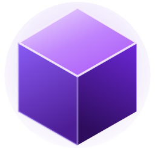

# Onyx

**One native app for the small, recurring chores of local development.**

Free a stuck port, keep your machine awake until a build finishes, see which repos are dirty or behind, reclaim disk from old `node_modules`, switch power plans, and keep your go-to commands one click away — all behind a single keyboard shortcut, with a tray dashboard next to your clock.

<p>
  
  
  
  
  
</p>

<sub>Local-first · no account · no telemetry · Windows 10/11</sub>

<br>

[Why Onyx](#why-onyx) · [What's inside](#whats-inside) · [Screenshots](#screenshots) · [Getting started](#getting-started) · [How it's built](#how-its-built) · [Contributing](CONTRIBUTING.md)

<br>

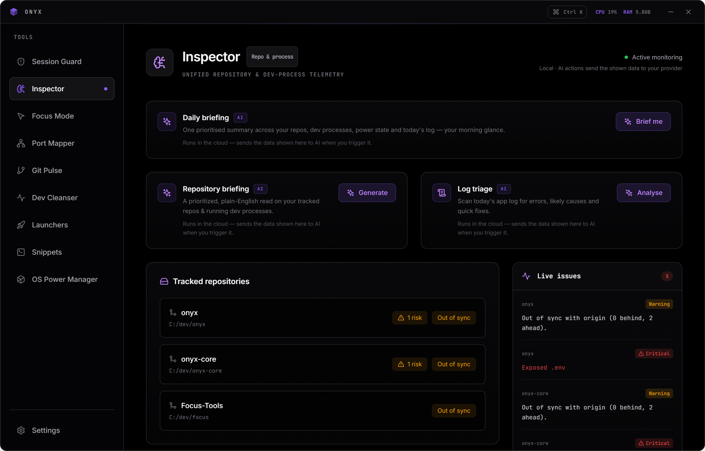

</div>

---

## Why Onyx

Every local project leaks the same small tasks across a dozen tools and terminal tabs: *what's on port 3000?*, *don't sleep mid-build*, *which repos did I forget to push?*, *where did my SSD go?*. Onyx pulls those into one fast, native panel with a consistent design and a quick-access tray — so the busywork takes a click instead of a context switch.

It runs entirely on your machine. There's no account and no telemetry; the optional AI features only run when you add your own API key, and only on the data shown in that panel.

## What's inside

| Module | What it does |
|---|---|
| **Port Mapper** | Live list of listening/established ports grouped by process — free any one in a click. |
| **Session Guard** | Hold a system wake-lock tied to a build/PID so the OS won't sleep mid-task, then auto-release and notify when it exits. |
| **Git Pulse** | Track local & GitHub repos at a glance: branch, dirty files, ahead/behind, risk flags, 14-day activity. A local repo and its GitHub twin auto-merge into one card (or link/unlink by hand); optional per-repo AI actions — commit message, explain the diff, draft a PR description, summarise history. |
| **Dev Cleanser** | Scan common dev folders for heavy `node_modules` and reclaim the space, with a guarded, confirmed delete. |
| **OS Power Manager** | Switch Windows power modes (optionally auto, on AC/battery) without touching brightness. |
| **Focus Mode** | Cursor auto-hide and distraction-free window rules. |
| **Launchers** | Start a whole local stack (frontend, API, database…) as one named profile. |
| **Snippets** | Keep the shell one-liners you keep retyping, one click to copy. |
| **Inspector** | A unified, local read-out of repo sync state and detected dev processes, with an optional one-glance **daily AI briefing** (repos + processes + power + logs) and focused insights. |
| **System Tray** | A customisable mini-dashboard (CPU, RAM, ports, guards) next to the clock. |

**Optional AI** — bring your own key for **Anthropic (Claude)**, **OpenAI (ChatGPT)** or **Google (Gemini)**. Keys are encrypted at rest in the OS keychain and never leave your machine except for the call you trigger.

**First-run setup** — a short guided onboarding picks your theme, accent and (optional) AI provider on first launch.

**Command palette** — press `Ctrl`/`Cmd`+`K` from anywhere to jump to any view or switch theme without the mouse.

**Backup & restore** — export your preferences, snippets and launcher profiles to a JSON file and restore them on another machine (secrets are never included).

**Themes** — Midnight, Pure OLED and Dracula, plus a pickable accent colour.

> [!NOTE]
> **Status — approaching the first tagged release.** Core modules work end-to-end; see [`CHANGELOG.md`](CHANGELOG.md) for what's landed.

## Screenshots

<div align="center">

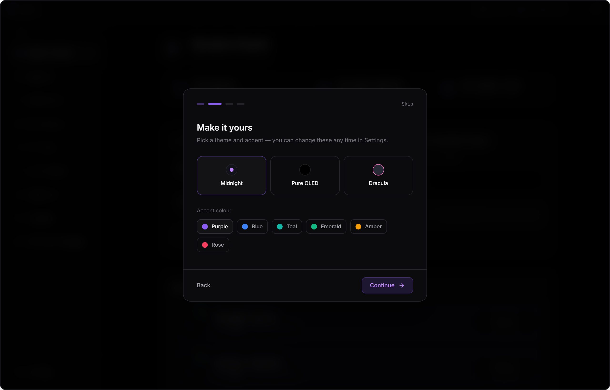

<sub><b>First-run setup</b> — pick a theme and accent, optionally add an AI key, in a few seconds.</sub>

<br><br>

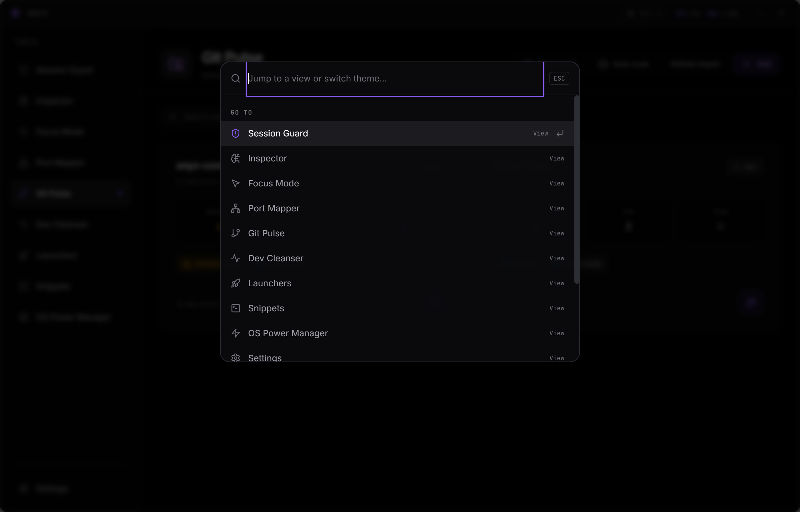

<sub><b>Command palette</b> — press <kbd>Ctrl</kbd>+<kbd>K</kbd> to jump to any view or switch theme without leaving the keyboard.</sub>

<br><br>

<table>
  <tr>
    <td width="50%">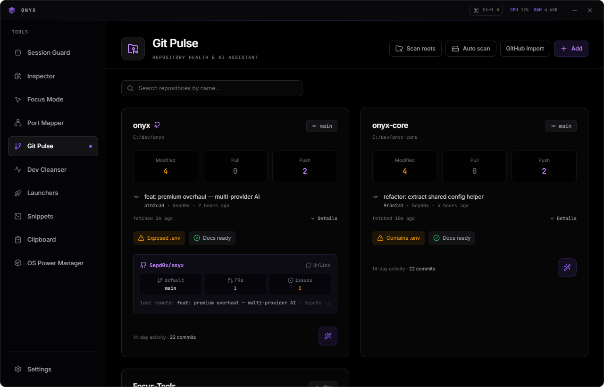<br><sub><b>Git Pulse</b> — repo health, with local repos merged into one card with their GitHub twin.</sub></td>
    <td width="50%">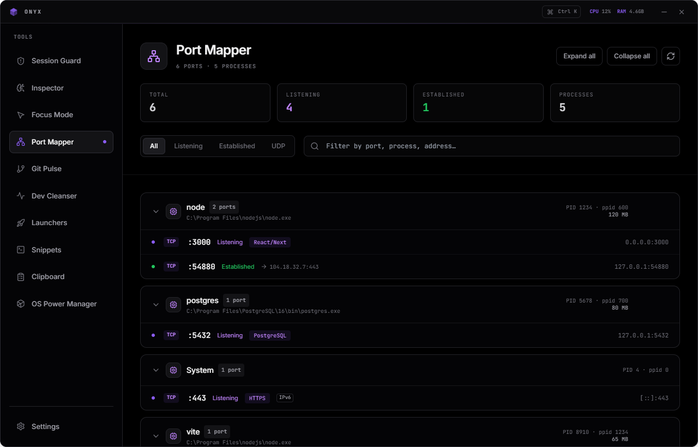<br><sub><b>Port Mapper</b> — listening/established ports grouped by process, freed in a click.</sub></td>
  </tr>
  <tr>
    <td width="50%">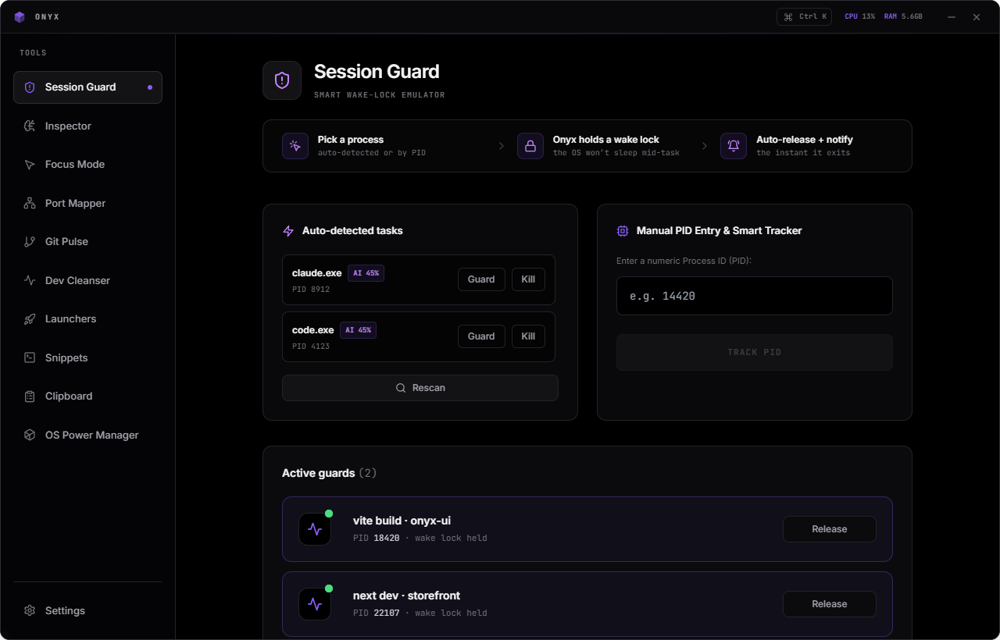<br><sub><b>Session Guard</b> — hold a wake-lock tied to a build so the OS won't sleep mid-task.</sub></td>
    <td width="50%">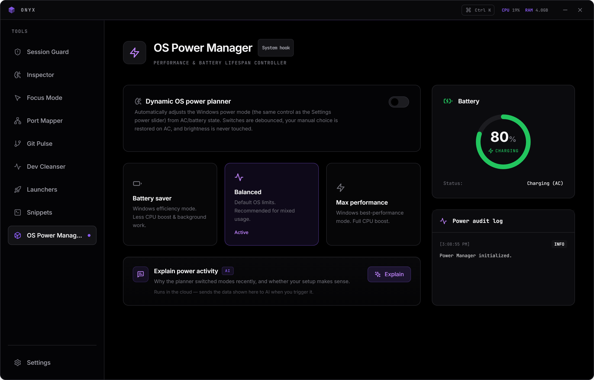<br><sub><b>OS Power Manager</b> — switch Windows power modes, optionally automatic on AC/battery.</sub></td>
  </tr>
  <tr>
    <td width="50%">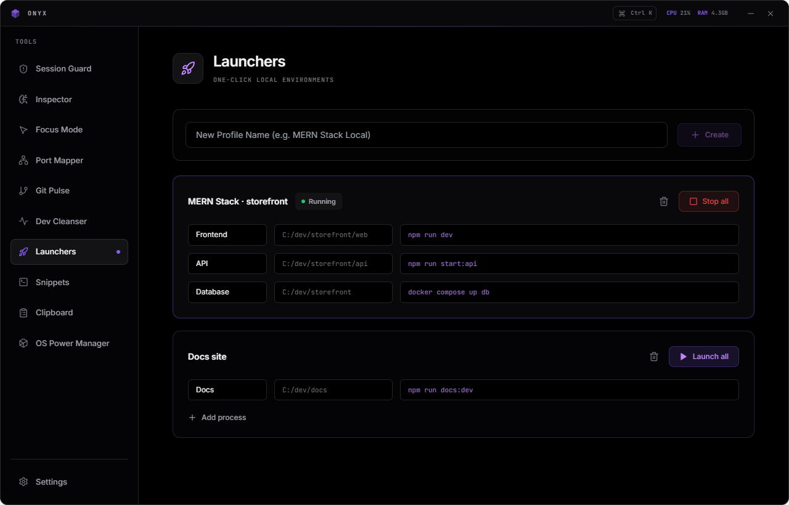<br><sub><b>Launchers</b> — start a whole local stack (frontend, API, database) as one profile.</sub></td>
    <td width="50%">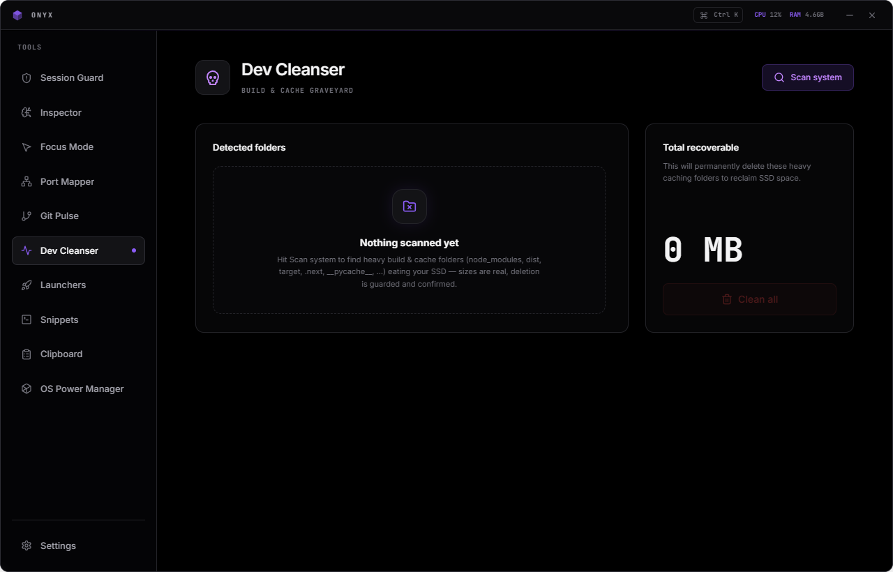<br><sub><b>Dev Cleanser</b> — find heavy <code>node_modules</code> and reclaim the space, guarded.</sub></td>
  </tr>
</table>

**Three themes**, switchable live with a pickable accent colour:

<table>
  <tr>
    <td width="33%"><br><sub><b>Midnight</b></sub></td>
    <td width="33%">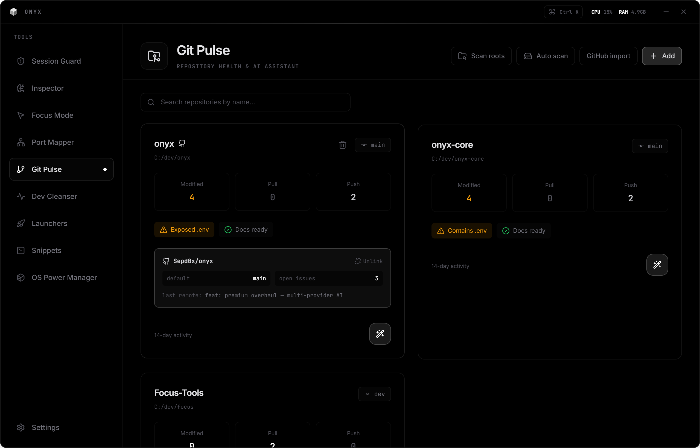<br><sub><b>Pure OLED</b></sub></td>
    <td width="33%">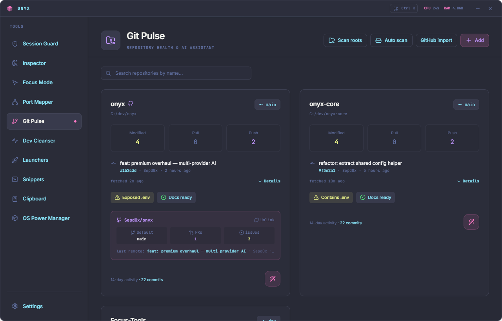<br><sub><b>Dracula</b></sub></td>
  </tr>
</table>

</div>

> [!NOTE]
> Captured from the live UI. Run `npm run onyx` to explore it yourself.

## Getting started

```bash
git clone https://github.com/Sepd0x/onyx.git
cd onyx
npm install
```

```bash
npm run onyx     # run the app (Vite UI + Electron together)
npm run build    # build a Windows installer + portable .exe into dist/
npm test         # run the test suite
```

You can also run the UI alone in a browser with `npm run dev` — a mock backend is injected so it's fully interactive without Electron.

**Requirements:** Node.js 20+ and npm; Windows 10/11 (primary target — some modules are Windows-specific).

## How it's built

- **Main process** — Node.js + Electron: a single source of truth for IPC channels, OS hardware events, native notifications, encrypted-at-rest secrets, auto-update.
- **Renderer** — React + Vite + TypeScript, Tailwind CSS with CSS-variable theming.
- **Security** — `contextIsolation` on, `nodeIntegration` off, sandboxed preload, a CSP, no secrets in plaintext, and no renderer access to the shell or filesystem (everything goes through validated IPC).

```
packages/
  core/    Electron main process, preload bridge, security, settings
  tools/   Native Node backends (ports, git, cleaner, power, AI, …)
  ui/      React + Vite renderer
```

See [`ARCHITECTURE.md`](ARCHITECTURE.md) for the security model and IPC boundaries, and [`CONTRIBUTING.md`](CONTRIBUTING.md) to get involved.

## Contributing & security

Contributions are welcome — start with [`CONTRIBUTING.md`](CONTRIBUTING.md) for setup, conventions, and the pre-commit gate. Please follow the [Code of Conduct](CODE_OF_CONDUCT.md).

Found a security issue? Report it privately — see [`SECURITY.md`](SECURITY.md). Onyx handles API keys and a GitHub token, so please don't open a public issue for vulnerabilities.

## License

[MIT](LICENSE).
